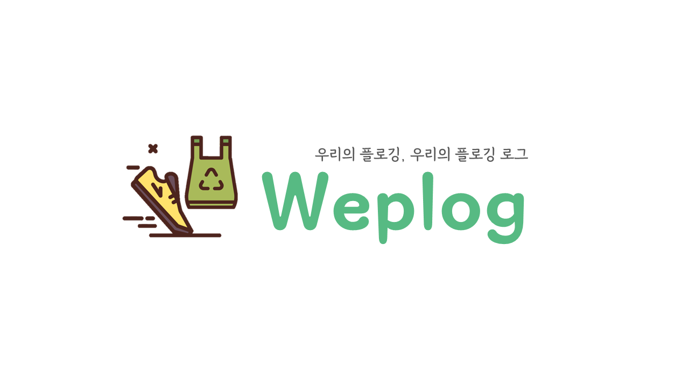
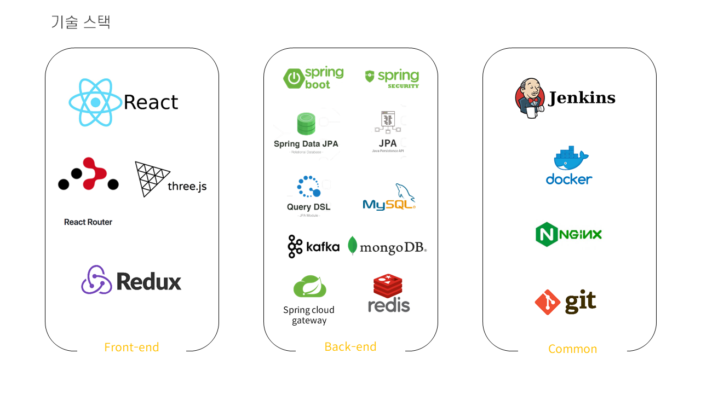
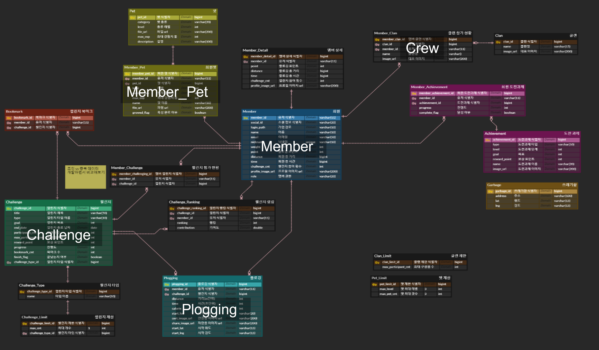
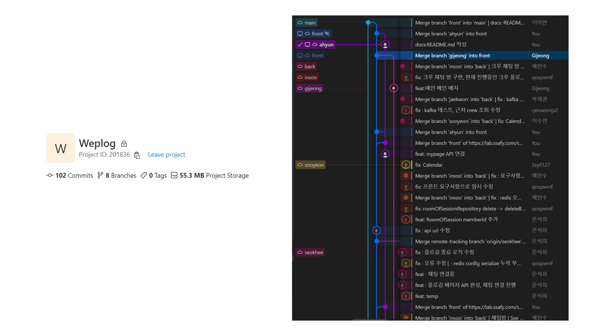
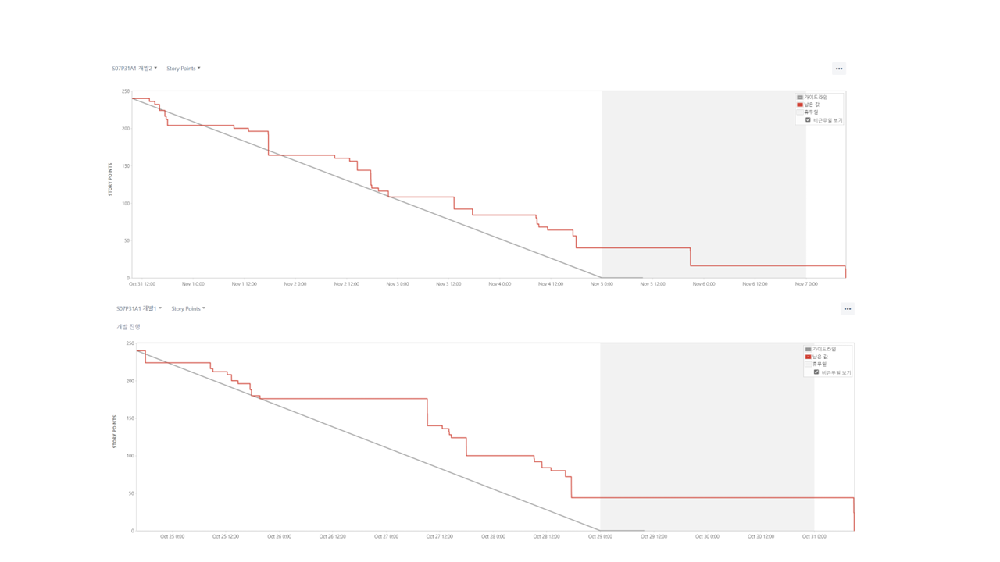
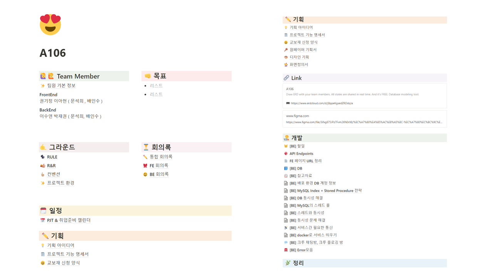
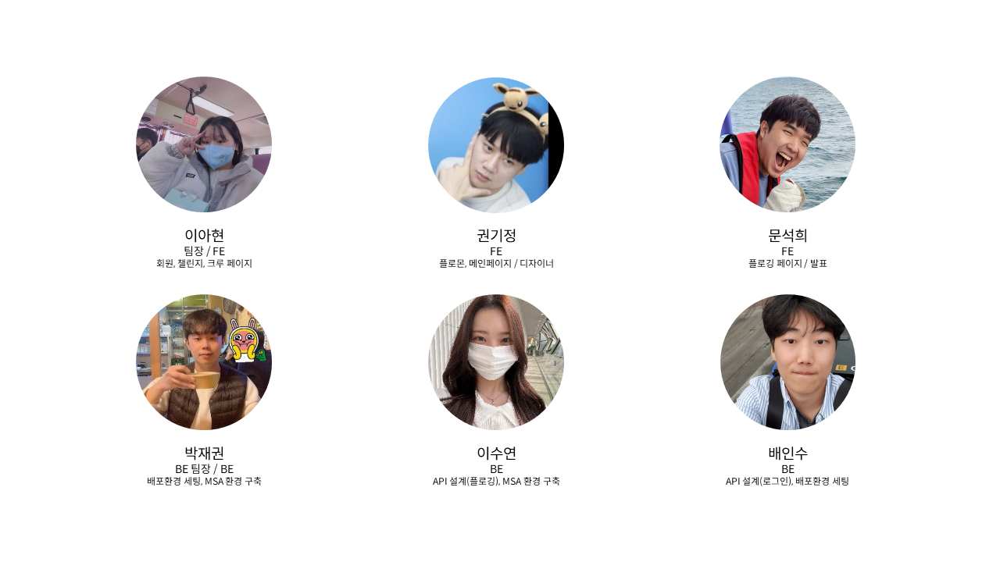

# ReadMe

## 💡 서비스 소개

**우리와 지구를 위한 Plogging 서비스**

> Weplog는 다양한 컨텐츠들을 통해 Plogging을 독려하고 쓰레기 문제를 인식해 궁극적으로 환경을 지킬 수 있도록 도와주는 서비스입니다.
> \*Plogging : Plocka upp (이삭을 줍다) + jogging 의 합성어로 조깅하면서 쓰레기를 줍는 행동

**우리의 플로깅, 우리의 플로깅 로그 Weplog**

## 🛠️ 기술 스택

 
    
   
   
   
   
   

   
   
   
   
  
   
   

  
  
  
  
  
  
  

 

## 🗃️ 프로젝트 구조

### ⛑ 기술 스택

### 🏗️ 서비스 구조

### 📂 파일 구조

**Front-End**

**Back-End**

## 🔗\***\*Database Modeling\*\***

## 💻 주요 기능 및 데모 영상

## 🎇 기대 효과

##### 1. 플로깅 활동 독려

크루, 챌린지, 플로몬 키우기 등 다양한 컨텐츠들을 통해 플로깅을 실천할 수 있습니다.
  플로깅을 진행하면서 더 많은 칼로리 소모를 할 수 있고, 환경보호를 실천할 수 있습니다.

##### 2. 환경문제 인식의 확산

플로깅을 통해 쓰레기를 주우면서 환경문제의 심각성을 인식할 수 있습니다.
  또한 이미지로 플로깅 로그를 저장하고, SNS에 공유하면서 사람들에게 환경보호 활동을 확산시킬 수 있습니다.

##### 3. 환경보호 활동의 실생활화

조깅을 하면서 쓰레기를 줍는 활동을 통해 오염 문제를 줄일 수 있습니다.
  또한 환경문제를 인식함으로써 궁극적으로 환경보호 활동을 실천할 수 있게 됩니다.

## 🗣️ 협업 관리

**Git Flow** 

---

**Jira BurnDown Chart** 
[JIRA 바로가기](https://ssafy.atlassian.net/jira/software/c/projects/S07P31A106/boards/100) 

---

**Notion** 
[Notion 바로가기](https://www.notion.so/A106-3bc641fa277a46b6a82aae0976fea8c4) 

## 👩‍👩‍👧 개발 멤버 소개

## 📅 프로젝트 기간

### 22.10.11 ~ 22.11.25

- **기획 및 설계** : 22.10.11 ~ 22.10.25
- **프로젝트 구현** : 22.10.25 ~ 22.11.13
- **버그 수정 및 산출물 정리** : 22.11.14 ~ 22.11.21
